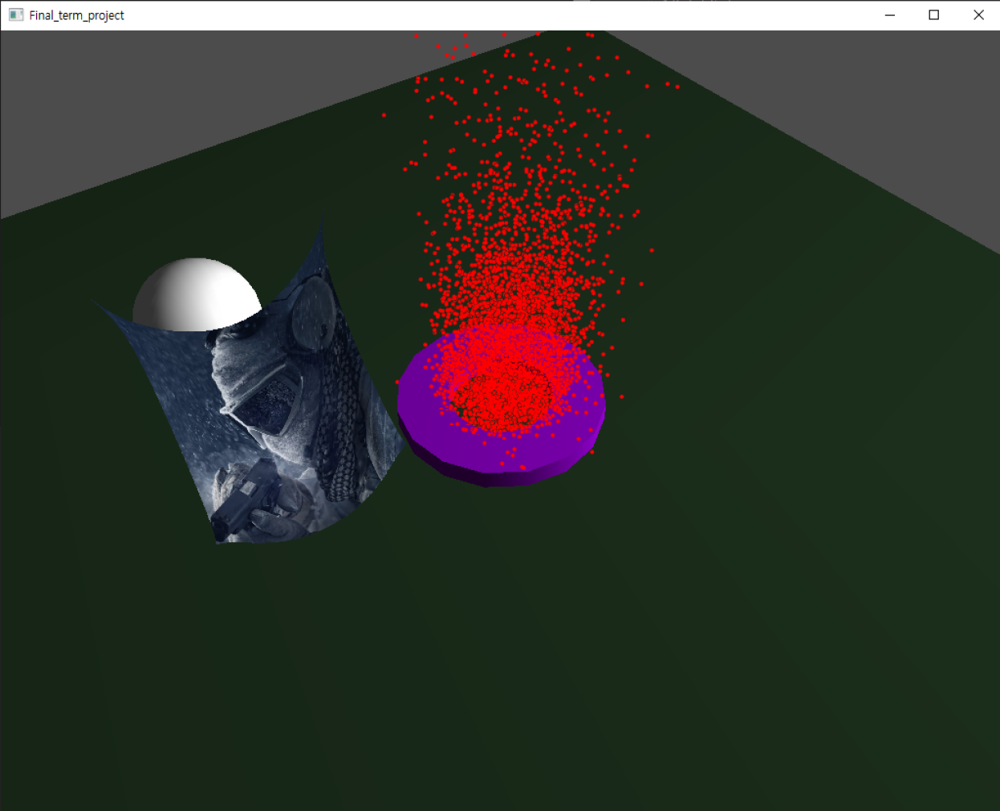

# 물리 시뮬레이션 프로젝트

---
* [COSE436] physics simulation project (rigidbody & deformable & particle system)
* 학부수업 기말고사 대체 프로젝트

### 프로젝트 설명

---

 * `rigidbody` / `deformable` / `particle system` 을 시뮬레이션할 수 있는 물리 시뮬레이션 프로그램이다. 
    * 불꽃이 튀는 모습 / 공중에 매달린 천이 펄럭이는 모습 / 천이 구와 충돌하는 모습을 볼 수 있다.
    * 다만 천이 구와 충돌할 때 자연스럽게 충돌하지 않는다. 그 외에는 정상적으로 작동하는 것을 볼 수 있다.
 * 조작법은 동봉한 `.pdf` 파일에 상세히 적혀 있다. 
 * 나머지 폴더는 프로젝트 폴더이다.

### 프로젝트 환경

---

* visual studio 2019
* `c++` project
* `openGL`

